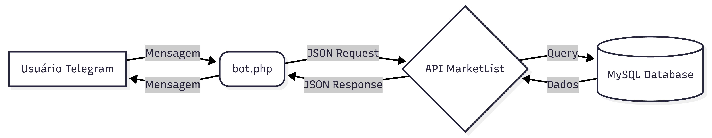

# 🛒 MarketList

> **Sua lista de compras inteligente, integrada ao seu dia a dia.**

O **MarketList** é uma solução de gestão de despesas e listas de compras baseada no conceito **API-First**. O sistema elimina a fricção de aplicativos financeiros tradicionais ao permitir o registro de gastos através de linguagem natural via **Telegram**, tudo sincronizado em tempo real com uma nuvem privada.

---

## 🚀 Sobre o Projeto

O objetivo do MarketList é centralizar o controle de compras (mercado, farmácia, gastos diários) de forma invisível e ágil.

Ao invés de abrir um aplicativo, navegar por menus e preencher formulários, o usuário apenas envia uma mensagem para seu assistente pessoal no Telegram. O backend processa a mensagem, calcula valores e organiza os dados para visualização futura em dashboards web ou mobile.

## ✨ Funcionalidades

- **💬 Integração Nativa com Telegram:** Interface via Chatbot (Webhook) rápida e leve.
- **🧠 Processamento de Linguagem Natural (NLP/Regex):**
  - Entende comandos como: `Comprei Picanha 89.90`
  - Suporta multiplicadores automáticos: `Comprei Leite 4.59 x 12` (Calcula o total e registra a quantidade).
- **🔐 Autenticação Híbrida:**
  - Sistema de Login via API (`/conectar email senha`).
  - Vinculação segura de dispositivo (Chat ID do Telegram atrelado ao User ID do banco).
- **☁️ Arquitetura Centralizada (API REST):**
  - O Bot não acessa o banco diretamente; ele consome a API do MarketList.
  - Preparado para escalabilidade e múltiplos frontends (React, Mobile App).
- **🛒 Gestão de Sessões:**
  - Comando `/finalizar` para fechar a lista, somar o total gasto e arquivar os itens.

---

## 🛠️ Stack Tecnológica

O projeto foi construído priorizando performance e arquitetura limpa:

- **Backend:** PHP 8+ (Vanilla - Sem frameworks pesados para máxima velocidade).
- **Banco de Dados:** MySQL (Relacional).
- **API:** RESTful (JSON).
- **Interface:** Telegram Bot API.
- **Hospedagem:** Compatível com Apache/Nginx (Linux).

---

## 🔌 Como Usar (Comandos do Bot)

### 1. Configuração Inicial
Para vincular sua conta do Telegram ao seu usuário no sistema:

~~~Plaintext
/conectar seu@email.com sua_senha
~~~

2. Registrando Compras
Basta digitar naturalmente. O sistema entende "Comprei" ou "Gastei".

Item simples:

~~~Plaintext
Comprei Arroz 25.90
~~~
Resultado: Salva "Arroz" no valor de R$ 25,90.

Item com quantidade (Multiplicação):

~~~Plaintext
Comprei Cerveja 3.99 x 6
~~~
Resultado: O sistema calcula (3.99 * 6), salva o item como "Cerveja (6x)" e o valor total de R$ 23,94.

3. Fechando a Conta
Ao terminar as compras, para receber o resumo:

~~~Plaintext
/finalizar
~~~
Resultado: O sistema soma todos os itens pendentes, exibe o total na tela e arquiva a lista.

🏗️ Arquitetura do Sistema
O fluxo de dados segue o padrão de gateway via API:

  

Isso garante que regras de negócio (como validação de usuário ou cálculo de totais) fiquem centralizadas na API, permitindo que no futuro um App Mobile consuma as mesmas regras.

🔮 Roadmap (Futuro)

[ ] Categorização via IA: Integração com OpenAI/Gemini para identificar automaticamente que "Detergente" pertence ao grupo "Limpeza".

[ ] Frontend Web: Dashboard administrativo construído com React e Shadcn/UI.

[ ] Múltiplas Listas: Suporte para alternar entre lista de "Mercado", "Viagem" e "Obras".

[ ] Relatórios: Gráficos mensais de evolução de gastos.

👨‍💻 Autor
Desenvolvido por Jhonata (Jhownny).

